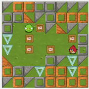

#### Split and Mill: user assisted height-field block decomposition for fabrication

Alessandro Muntoni, Lucio Davide Spano,  Riccardo Scateni

Smart Tools and Applications in Graphics, 2019 (Cagliari, Italy)

[Paper] [Code] [Data] [PPT] [Web Site] [BibTex] [Digital Library]

#### ChIP: Teaching coding in primary schools

Fabio Sorrentino, Lucio Davide Spano, Sara Casti, Alessandro Carcangiu, Fabrizio Corda, Gianmarco Cherchi, Alessio Murru, Alessandro Muntoni, Stefano Nuvoli, Riccardo Scateni

CEUR Workshop Proceedings 1910, 106-110, 2017

[Paper] [BibTex]

